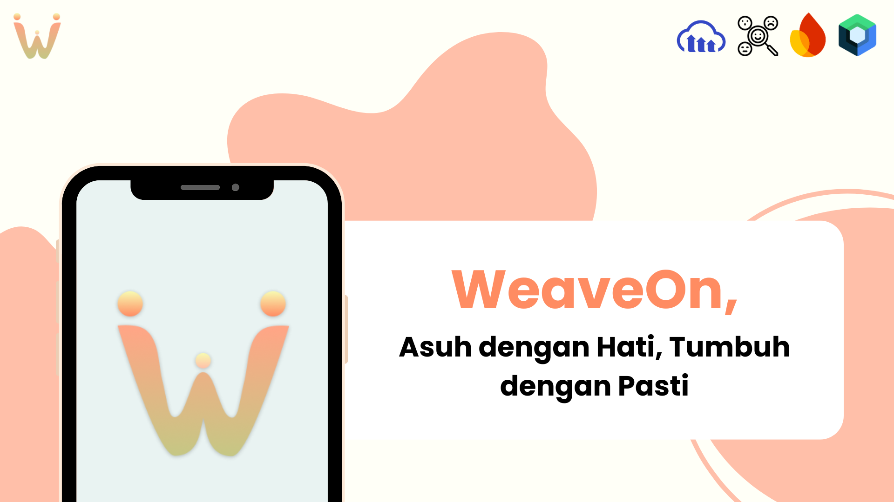

<h2 align="center">
  <b>WeaveOn - Mobile App (Jetpack Compose) 👶🏻</b> 
</h2>

As a team committed to **inclusive technology and child development**, we build **WeaveOn**, a mobile app designed to support **children with special needs** through emotional awareness and adaptive activities. This project was developed as part of **Hology 8.0**, a national level innovation competition organized by the **Faculty of Computer Science, Universitas Brawijaya**.

WeaveOn integrates **AI-based emotion detection** that analyzes children's facial expressions in real time while they engage in guided activities. The goal is to help parents and educators understand emotional patterns, identify comfort zones, and encourage growth through personalized activity recommendatons.

Built using **Jetpack Compose**, **Firebase**, **Cloudinary**, and powered by the **FER (Facial Emotion Recognition) library**, WeaveOn aims to make emotionals insights accessible, engaging, and meaningful for every child. Transforming technology into an empathetic companion for development. 🌈

## ✨ Features (MVP)

The initial MVP of WeaveOn includes three core features:
- 🎨 Wevy : Guided activities across categories with real time facial emotion detection.
- 🧩 Exercises : Developmental challenge where children can document their progress with photos.
- 📊 Report : Visualizes emotion analysis through charts, highlighting the child's favorite activities and growth potential.

## 🛠️ Tech Stack

- Kotlin + Jetpack Compose (UI)
- Firebase (Authentication, Realtime Database)
- Cloudinary (Cloud Storage)
- FastAPI (Backend API)
- FER (Facial Emotion Recognition Library for emotion detection)

## 🧠 AI Model Repository

The emotion analysis API, built with **FastAPI** and powered by the **FER** library, extracts frames from uploaded activity videos and detects emotions on each frame. It assigns weighted scores for each emotion to generate an overall emotional label (e.g., *Sangat Senang, Kurang Senang*) and provides an emotion distribution summary.
🔗 [View Repository](https://github.com/muktiabdii/weaveon-api)

## 📸 Prototype

  

  

## 👥 Group Sapipel Pliser

- [@Safira](https://www.linkedin.com/in/antikerahmasafira/) — Product Manager
- [@Azzel](https://www.linkedin.com/in/noorazizahzp/) — UI/ UX Designer 
- [@Abdi](https://www.linkedin.com/in/muktiabdii/) — Fullstack Developer
